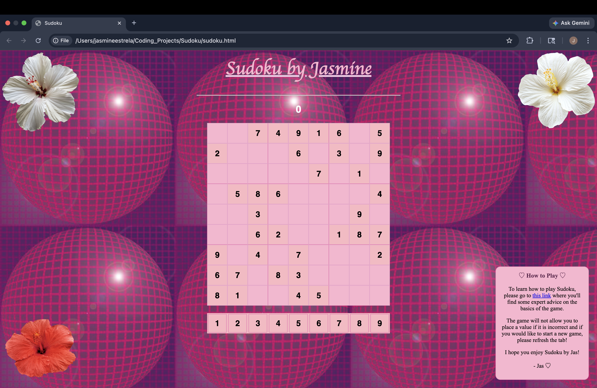

# 🌺 Sudoku by Jasmine

A summery, hyper-feminine sudoku game built with HTML, CSS, and JavaScript.

## Screenshot

## Features

- 9x9 playable sudoku board
- Error tracking
- Hibiscus flower corner decorations
- Hover-reveal "How to Play" instructions box
- Custom pink & magenta aesthetic with a dreamy background

## How to Run

1. Clone or download this repository
2. Open `sudoku.html` in your browser
3. No installation required!

## Technologies Used

- HTML
- CSS
- JavaScript

## Credits

- Hibiscus flower images sourced online
